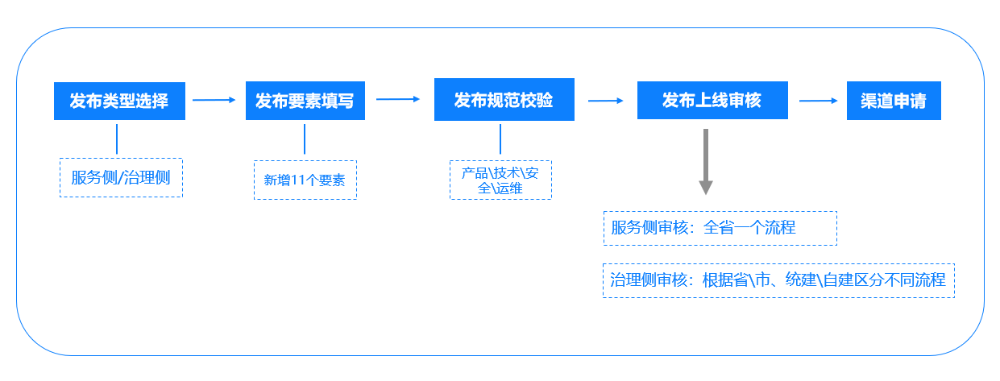
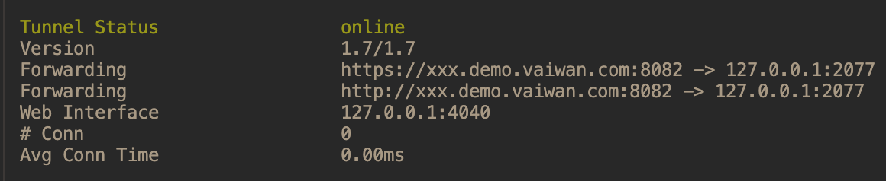
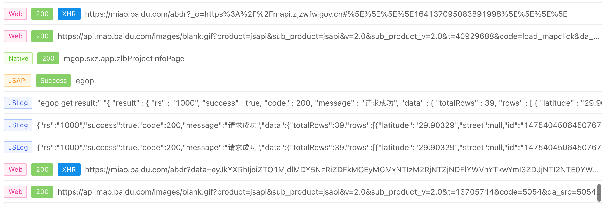
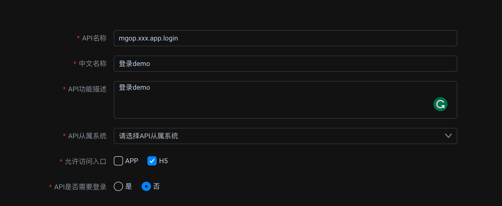
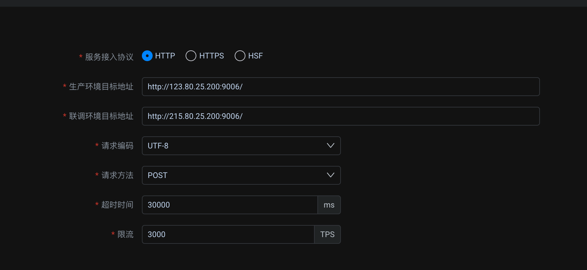
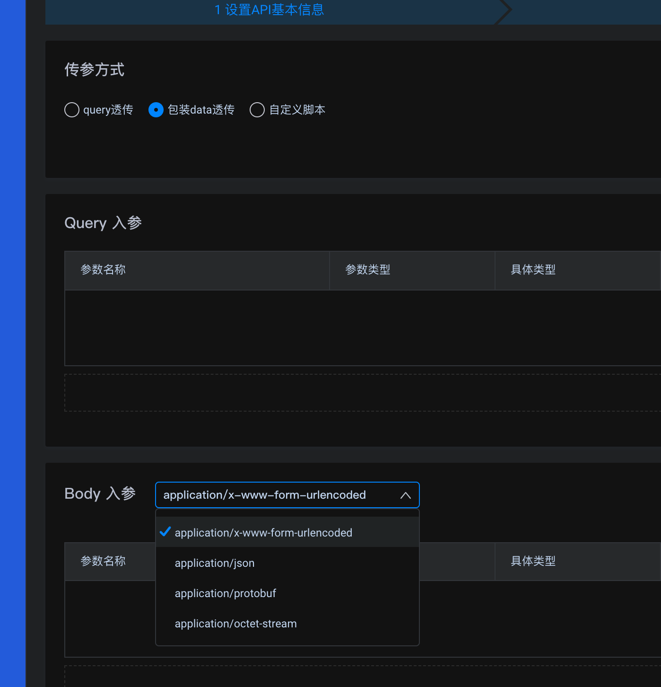
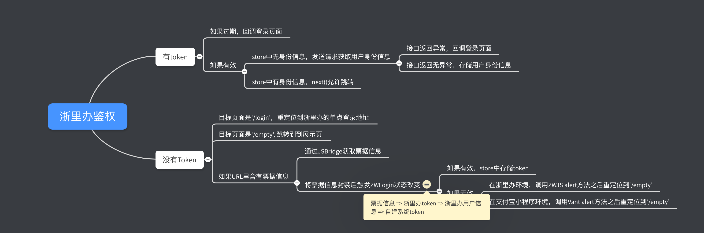
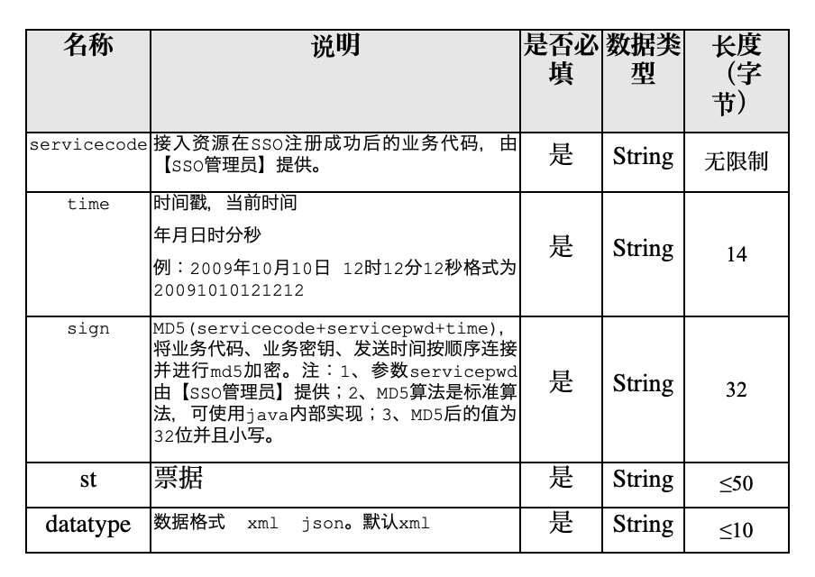
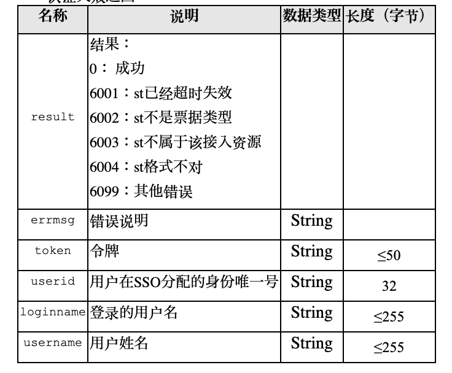

# 浙里办/IRS系统H5应用上架对接流程

## 目录
- [1. 发布流程](#1.&nbsp;发布流程)
- [2. 调试工具](#2.&nbsp;调试工具)
- [3. 适老化](#3.&nbsp;适老化)
- [4. MGOP接口对接规范](#4.&nbsp;MGOP接口对接规范)
- [5. 单点登录(个人登录)](#5.&nbsp;单点登录(个人登录))
- [6. 部署发布](#6.&nbsp;部署发布)
### 写在前面的话(2022年1月7日)
因为司现在前后端的技术栈为Vue/SpringBoot/Nginx/MySql,所以在上线时需要针对IRS这套应用上架的审核流程做诸多相应的调整，我作为第一次接手政府项目的前端菜鸟负责人，其中也是走了不少弯路，所以写下这篇指南的目的一是为了总结回顾自己跨过的坑，二是给同样需要开发IRS应用的pong友们提供一个在官方说明以外的补充（数梦工场Document的质量，懂的都懂）。值得注意的是，在我接手这个项目的不到半年时间内，浙里办系统的对接标准已经经历过数次迭代，所以我无法保证本篇指南的时效性能有多强，主要是提供一个发布流程的大体把握和思路。具体的问题，还是需要添加官方的钉钉群和负责的老师们沟通解决为佳。

## 1.&nbsp;发布流程
自建H5应用在部署发布到浙里办系统在2021年底12月之后统一通过浙江省一体化数字资源系统(IRS)部署发布。因为这个系统的本质其实就是把我们开发的应用部署到官方的容器中使用，所以开发标准和规范都需要按照官方的要求来走，否则很可能会影响应用上架。这里给出一个IRS应用的发布流程图。发布类型的区别举例子说明：如果是浙里办的话就是服务侧应用，需要走省里的审核流程。例如浙政钉的话就是治理侧应用，审核流程只需要走到市里的大数据局就可以了。
 

因为现在IRS的发布把业主和开发商的账户分开了，所以现在官方给的对接文档有两份，一份是[IRS应用发布（开发商）](./files/kfs.pdf)给我们提交应用和修改接口时使用，一份是[IRS应用发布（政府工作人员）](./files/yz.pdf)用来给业主提交申请和审核应用（其实大多数时间还是我们用-.-）。
### 1.2&nbsp;系统账号申请
系统在申请前需要做2个准备工作
1. 政府工作人员已获取登录账号 => 通过委托我们开发单位的负责人通过浙政钉系统内部的“机关内部最多跑一次”来申请系统, 获得IRS主工作台的登录账号。
2. 公司要提供一个联系人和手机号码在委托单位下开一个浙政钉的账户，这两个信息是需要在系统申请的时候就给出，以便后期用来登录IRS开发商工作台。 

之后具体的申请流程请参考IRS应用发布（政府）这份文件进行操作。

## 2&nbsp;调试工具
因为浙里办容器的本质，所以在没法在PC上进行本地调试，这里就推荐两个帮助我们调试的工具： 1）Pierced和2）政务中台ZWEurope

### 2.1&nbsp;Pierced

这个工具本来是用来调试浙政钉的，但是这两个系统使用的JSBridge是同一个，所以我们可以用来模拟应用CSS布局在浙里办上的环境。因为使用的是linux命令，所以在Mac和Windows上都能够运行。

比如我现在的前端服务在`http://localhost:2077/`这上面，以Mac为例，我在终端里就可以进入Pierced所在的文件目录，进入到其中的mac_64子目录，输入
```shell
./ding --config=./ding.cfg --subdomain=xxx.demo 2077
# ./ding 为执行脚本
# config 是一些配置，默认用ding.cfg这个就好
# subdomain 是我们想要映射出来的虚拟IP地址的
```
输入完之后敲回车，如果成功就可以看到下面这个输出，这样就可以愉快的用外网访问我们本地的这个服务啦～


### 2.2&nbsp;vConsole

在H5开发中，我们往往会遇到在真机上调试没法看到调试信息的问题，我个人一直在用的工具是这个vConsole，原因嘛大概就是这个只需要安装依赖之后在入口文件引入之后就可以用了，基本上属于0配置。缺点就是有些和浙里办相关的调试信息用这个是看不到的。

### 2.3&nbsp;ZWEurope

这个是官方推荐使用的Debug调试工具，在线上测试应用的时候基本上都是vConsole配合这个ZWEurope看控制台里的`console.log`信息和查看接口请求有没有发送成功的。

下载的地址就不放出来了，用业主负责人老师的账号登录[政务中台](https://op.zjzwfw.gov.cn/mobile/login)找到调试工具下载Mac或者Windows版本的应用即可。

使用的时候需要
- 打开ZWEurope, 点击日志
- 调试用手机进入浙里办扫描上一步出现的二维码

完成之后就会看到ZWEurope像浏览器的F11一样打印出一系列调试信息。这样就可以解决在浙里办App中无法查看浙里办平台调试信息的问题

## 3.&nbsp;适老化
因为我也是第一次接受浙里办的H5开发，所以在开发流程这里遇到了挺多弯路的，主要就在1）适老化，2）接口的对接和3）单点登录这三个大点上。

适合化的要求是提供两套UI方案，在用户切换浙里办App中的**长辈版**后切换到“大字体”版本,所以建议在系统开发已开始就让UI开发根据要求制定两套主题方案以避免后期需要一个个修改css文件的窘境。这里就需要用到浙江政务提供的zwjsBridge,具体的说明请参考[JSBridgeAPI说明](./files/elder.pdf)这份文件。因为我前端用的是Vue配合less样式，所以我大体的思路就是

### 3.1&nbsp;在入口的`/public/index.html`中插入JSBridge 
> ⚠️ 注意：ZWJSBridge版本如果参照一些旧的指南用**1.0.0**的会没有getUIStyle的API，请使用**1.0.1**版本的

```html
<!--  在head标签中插入 --
<head
  <!-- <script type="text/javascript" src="//assets.zjzwfw.gov.cn/assets/ZWJSBridge/1.0.0/zwjsbridge.js"</script --
  <script type="text/javascript" src="//assets.zjzwfw.gov.cn/assets/ZWJSBridge/1.0.1/zwjsbridge.js"</script
</head>
<!-- 其他部分省略 -->
```

### 3.2&nbsp;进入H5后调用JSBridge检查当前用户的uiStyle，如果为然后把这个状态储存在Vuex里。
```javascript
/* ./src/composables/uiStyle */
import store from '@/store'

export const getUIStyle = () => {
  ZWJSBridge.onReady(() => {
    console.log('zwjsbrige 可调用')
    ZWJSBridge.getUiStyle()
      .then((result) => {
        const { uiStyle } = result
        store.dispatch('SetUIStyle', uiStyle)
        console.log(`store存储为: ${store.getters.uiStyle}`)
    })
      .catch((error) => {
        console.log(error)
        store.dispatch('SetUIStyle', 'normal')
      })
  })
}
```
### 3.3&nbsp;创建相应状态的`mutation`和`action`
我的个人习惯是有关浙里办的部分单独写在一个`module`下面,类似下面这样
```javascript
/* ./src/store/modules/zwjs */

const zwjs = {
  state: {
    // long: '', // 纬度埋点
    // lati: '' //经度埋点,
    // ticket: null, 
    uiStyle: null,
  }, 
  mutations: {
    SET_UISTYLE: (state, style) => {
      if(!style) return
      state.uiStyle = style
    }
  },
  actions: {
    SetUIStyle({ commit }, payload) {
      commit('SET_UISTYLE', payload)
    }
  }
}
```
uiStyle这个属性可以在在store的getters里面单独暴露出来。

### 3.4&nbsp;储存全局状态 
组件在进行渲染的时候就要根据store中存储的`uiStyle`字段动态判断某个元素所采用的css类，以此来达到适老化所想要的效果。
```javascript
// xxx.vue中

<script>
export default {
  computed: {
    ...mapGetters(['uiStyle']),
  }
}
</script>

<style lang="less" scoped>
  .title {

  }
  .title--elder {

  }
</style>

<template>
  <div>
  <div :class="$store.getters.uiStyle === 'elder' ? 'title--elder' : 'title'">
      标题
    </div>
  </div>
</template>
```
## 4.&nbsp;MGOP接口对接规范 
因为公司现在的前端技术栈是Vue全家桶，在处理接口请求的时候都是用的Vue脚手架的`devServer.proxy`, 让**axios.js**配合**nginx**做反向代理。但是这套逻辑在浙里办这里是行不通的——因为在浙里办的容器里我们没法在服务器里配置Nginx，所以所有的接口请求在浙里办的线上环境里都是跨域的。我也是在摸索了好久之后，问了浙里办对接的老师才发现必须使用Mgop来包装我们的请求，通过官方提供的MGOP，一个封装好的js库来解决跨域问题。

### 4.1&nbsp;MGOP接口配置
首先讲讲在工作台里怎么配置MGOP接口,详细说明请看[]()
1. 首先找到**API管理**
2. 点击**新建API**
3. 配置API名称：
  API名称固定用`mgop.${app_id}.app.${api_name}`这种形式，其中app_id一定得是应用申请通过后大数据局发过来的excel里的app_id， api_id为我们系统里实际的名称；api从属系统选择当前要上架的应用名称；是否需要登录就选**否**
   
4. 配置API地址：这里的两个地址顾名思义就是生产环境和测试环境的后台接口地址，在对接单点登录之前都可以在浙里办的地址后面加上`/debug`来访问测试环境的地址。
> ⚠️ 单点登录因为需要找钉钉里面的老师配置回调地址，所以无法这么直接切换环境
  
5. 配置API入参出参： 
  

### 4.2&nbsp;Axios封装请求
所以现在的问题就是——在开发过程中用的Axios，在线上发布的时候需要用另外MGOP来发送API请求，所以需要做2套接口？这我肯定是不愿意的, 我所做的就是通过**Node.js**的环境变量帮助我用两种不同的封装方式发送同一套接口请求。

**Before**: 在对接之前，我原先封装好的`request.js`：
```javascript

/* ./src/utils/request.js */
const service = axios.create({
  timeout: 1000000 
})

// 请求拦截
service.interceptors.request.use(config => {
  if (!config.noLoading) {
    showLoading() // 加载转圈
  }
  const token = getToken() // 获取JWT令牌
  if (token) {
    config.headers['Authorization'] = 'Bearer ' + token
  }
  return config
})

// 报文拦截
service.interceptors.response.use(response => {
  /* 省略 */
})

export default request
```

```javascript
/****************************
 *  用户登录
 *  @params: {
 *    data: {userInfo: Object}
 * }
 *****************************/
export function login(data) {
  return request({
    url:'/api/login',
    method: 'POST',
    data,
  })
}
```
### 4.3&nbsp;封装MGOP请求
1. 为了仿照axios的传参数方式，配合上官方给出的MGOP使用说明，我们可以尝试把MGOP封装成一个Promise方法，类似下面这样:
> ⚠️ 注意：这里的appKey在开发平台里找不到的，应用名称申请通过之后大数据局会发一个excel给业主的负责人老师，里面有具体信息。如果找不到的，需要自行联系钉钉里面的老师让再发一份。
```javascript
/* ./src/utils/mgop.js */

import { mgop } from '@aligov/jssdk-mgop'
import { getToken } from '@/utils/auth.js'
import { showLoading, hideLoading, destoryLoading } from '@/utils/loading.js'

export const mgopRequest = (payload) => {
  return new Promise((resolve, reject) => {
    showLoading()
    // 仿照axios的传参方式
    const data = Object.assign({}, {
        api: payload.zwApi, // 必须,政务中台rpc接口的制定名字。例如‘mgop.xxx.app.login’
        host: 'https://mapi.zjzwfw.gov.cn/',// 固定为这个地址
        dataType: payload.dataType || 'json', // 目前官方只支持JSON格式
        data: payload.data || payload.params, // 不管入参是query还是body都同意用data传入，到时候在工作台里配置即可
        type: payload.method, // 和axios一样
        isBuffer: payload.isBuffer, 
        appKey: 'xxxx', // 必须，政务中台appKey, 系统申请之后大数据局发过来的excel里有
        // 成功后的回调
        onSuccess: data => {
          console.log(data.data)
          hideLoading()
          resolve(data)
        },
        // 请求失败后的回调
        onFail: err => {
          console.log(err, 'err')
          destoryLoading()
          reject(err.message)
        }
      },  
      // 是否需要传JWT令牌,对于登录和一些免登接口，payload.noToken = true
      payload.noToken ? 
      {} : 
      { header: { Authorization: 'Bearer ' + getToken() } }
    )
    mgop(data)
  })
}
```
2. 接下来我们需要做的就是通过全局对象process.env.NODE_ENV来判断当前环境是开发环境还是浙里办环境，如果是开发环境还是用`request`还是用**axiosService**，如果是浙里办环境`request`就用`mgopRequest`。现在`request.js`的其他不变，`export`的部分变成这样
```javascript
/* ./src/uitls/request.js */

import { mgopRequest } from './mgop'

const isMgop = process.env.NODE_ENV === 'aligov' // 是否为浙里办版面
const request = isMgop ? mgopRequest : request 
export default request
```
**After**: 我们在使用写接口的时候就只需要添加zwApi这个属性就可以指定使用的MGOP接口，借此实现写一套接口走两种请求。
```javascript
export function login(data) {
  return request({
    url:'/api/login',
    method: 'POST',
    data,
    zwApi: 'mgop.xxx.app.login', // 制定对应MGOP接口
    noToken: true, // 因为登录接口不需要传JWT令牌所以为true, 一般接口不需要这个属性
  })
}
```
## 5.&nbsp;单点登录(个人登录)
单点登录也是对接浙里办系统的一个大难点，可能因为本人阅读理解的问题导致完全看不懂官方文档说的是啥，网上搜出来的资源也没有完全回答清楚的。如果没有看到[这篇文章](https://juejin.cn/post/7005871168733315085)，真不知道自己还要踩多少坑。
> Talk is easy, show me the code!
### 5.1&nbsp;鉴权逻辑
下面是我司H5应用在**Vue-Element-Admin**的基础之上，对接单点登录时重新梳理过的鉴权逻辑：

可以发现在获取到了token之后流程都和一般Vue应用并没有，主要的变化就是体现在
- A）核心流程：票据信息 ➜ 浙里办系统token ➜ 浙里办用户个人信息 ➜ 自建系统token 
- B）重定位到浙里办的单点登录地 
- C）获取票据信息
- D）票据无效时跳转展示页



### 5.2&nbsp;**核心流程： URL ➜ 票据信息 ➜ 浙里办系统token ➜ 浙里办用户个人信息 ➜ 自建系统token**

1. **获取票据**: 这个是Vue3风格的composables用法，不过因为目前项目还是用的`vue@2.6`,所以用到的地方其实也不多, 主要就是获取票据，获取url参数和判断浙里办环境这几个小功能
```javascript
/* ./src/composables/zwLogin/useTicketRepository.js */

/* 因为在浙里办单点登录之后，票据都是储存在url里的，所以我们需要捕捉这个票据 */
export const useTicketRepositories = () => {
  let ticket = null 
  const url = window.location.href
  if (url.indexOf('ticket') !== -1) {
    const params = url.split('?')[1].split('&')// 截取路由
    for (let index = 0; index < params.length; index++) {
      if (params[index].indexOf('ticket=') != -1) {
        ticket = params[index].split('=')[1]// 获取路由ticket
        break
      }
    }
  }

  return { ticket } // Todo 这里其实还可以仿造React Hooks的方法，放入setTicket函数
}

/* 获取获取url里带的参数*/
export const param = (data) => {
  let url = ''
  for (let k in data) {
    const value = data[k] !== undefined ? data[k] : ''
    url += `&${k}=${encodeURIComponent(value)}`
  }
  return url ? url.substring(1) : ''
}

/* 判断是浙里办app还是支付宝浙里办小程序 */
export const sUserAgent = window.navigator.userAgent.toLowerCase()
export const bIsAlipayMini = sUserAgent.indexOf('alipay') > -1

```

> 浙里办上面的用户信息是通过请求浙江政务服务网获取的请参考[个人用户对接技术文档](./files/oath.docx)，如果想要获取用户的身份信息就得通过1）票据认证`ticketValidation` 和2）获取用户详细信息`getUserInfo` 来完成。

2. **票据认证**: 票据认证得在获取url里的票据之后附带下图这几个参数来完成。这里我就对这个请求进行了类的封装方便后续调用。

票据认证入参             |  票据认证出参
:-------------------------:|:-------------------------:
| 

> ⚠️ 特别注意，在获得票据请求浙里办系统的token之后需要再次发送一次mgop请求才能获得用户信息，所以我们的后台服务器还需要根据[个人用户对接技术文档](./files/oath.docx)浙江政务服务网第地址帮我们转发`ticketValidation`和`userInfo`两个请求！！！


```javascript
/* ./src/api/zw/loginManage.js */
import request from '@/utils/request.js'
import moment from 'moment'
import MD5 from '@/utils/md5.js' // MD5算法，请参见附录

export class TicketRequest {
  constructor(requestParams) {
    this.serviceCode = process.env.VUE_APP_SERVICECODE // 存储在环境变量中的服务接入码
    this.pwd = process.env.VUE_APP_PWD // 存储在环境变量中的业务密码
    this.time = moment(new Date()).format('yyyyMMDDhhmmss')
    this.sign = MD5(`${process.env.VUE_APP_SERVICECODE}${process.env.VUE_APP_PWD}${this.time}`)
    this.st = requestParams.st // 单点登录获得的票据
    this.method = requestParams.method // 固定要穿‘ticketValidation’进来
    this.datatype = 'json' // 因为我司后端接口用的是json格式，如果用的是xml就写‘xml’
  }

  getRequest() {
    return {
      serviceCode: this.serviceCode,
      time: this.time,
      sign: this.sign,
      st: this.st,
      method: this.method,
      datatype: this.datatype
    }
  }
}

// 使用时只需要类似下面这样就可以浙里办系统的token
// const ticketRequest = new TicketRequest({ st: [单点登录url里截取的票据信息], method: 'ticketValidation' })
// const params = ticketRequest.getRequest()
```
3. **获取用户信息**: 

在获取票据信息并获取浙里办token之后，还需要发送`getUserInfo`这个接口。我司现在的方案是-和后台的小伙伴沟通之后决定这两次请求统一由后端转发，前端只需要把第一次请求的参数通过MGOP传到自家的后台服务器`/zlbLogin`这个路径，后台服务器会根据浙里办返回的用户信息（手机号码）匹配我司系统里注册的用户，并返回redis里的token信息。如此一来，可以一步到位地对接起浙里办的单点登录信息。

> `zlbLogin`这个接口需要在开发者后台里进行MGOP配置，如果不明白请看第四点或者私信我；这一步如果采用两次请求的方案——就需要后台分别转发`ticketValidation`和`getUserInfo`这两个MGOP请求，请自行和后端工程师合作解决。

```javascript 
/* ./src/api/zw/loginManage.js */

export class TicketRequest { /* ... */ }

/***
* 获取浙里办系统的用户信息和自建系统匹配获得自建系统的token
* params： { serviceCode, time, sign, st, datatype }
***/
export function postTicket(params) {
  return request({
    zwApi: 'mgop.sxz.app.zlbLogin',
    method: 'GET',
    params,
    noToken: true
  })
}
```
个人习惯还是会把这些信息存储在store里，因为之前已经在做适老化的时候已经创建了相应的store module，所以我们现在只需要更新`./src/store/modules/zwjs.js`这个文件即可
```javascript
const zjzw = {
  state: {
    ticket: null,
    uiStyle: null,
  },
  mutations: {
    SET_TICKET: (state, ticket) => {
      // state.ticket = ticket
      setToken(ticket)
    },
    SET_UISTYLE: (state, style) => {
      console.log(style)
      if (!style) return state.uiStyle = 'default'
      state.uiStyle = style
    }
  },
  actions: {
    /* 单点登录 */
    ZWLogin({ commit }, payload) {
      return new Promise((resolve, reject) => {
        console.log(payload)
        postTicket(payload)
          .then(res => {
            console.log('成功从浙里办跳回zj系统，回复为')
            console.log(res)
            if (res.data.code === 500) return reject(res.data.message)
            if (res.data.data.indexOf('errmsg') > -1) return reject('票据已过期，请重新登录')
            const response = res.data
            commit('SET_TICKET', response.data)
            resolve(response)
          })
          .catch(err => {
            console.log(err)
            reject(err)
          })
      })
    },
    /* 适老化 */
    SetUIStyle({ commit }, payload) {
      commit('SET_UISTYLE', payload)
    }
  }
}

export default zjzw

```
### 5.3&nbsp;鉴权的具体实现
**A）单点登录入口重定向**
```javascript
/* ./src/utils/permission.js */

import { useTicketRepositories, param, bIsAlipayMini } from '@/composables/zwLogin/useTicketRepository'
import { TicketRequest } from '@/api/zw/loginManage'

// 每次路由跳转时都要进行判断
router.beforeEach((to,from,next) => {
  if( getToken() ) {
  /* 有token信息的过程省略 */
  } 
    /* 没有token信息的情况 */
  else {
    // '/empty' 直接访问展示页面
    if (to.path === '/empty') {
      console.log('即将前往展示页面')
      return next()
    }

    const url = window.location.href // 获取当前页面url 
    
    // 如果不含有票据信息
    if(url.indexOf('ticket') < 0) {
      if(!whiteList.includes(to.path)) {
        return next('/empty')
      }
      // 如果为浙里办线上环境
      if (process.env.NODE_ENV === 'aligov') {
        const url = to.path + '?' + param(to.query)
        console.log(`即将前往${to.path}`)
        console.log(`携带参数${param(to.query)}`)
        // 因为浙里办的登录和页面的跳转不是同步的过程，所以不好写在跳转链接下
        window.location.replace(`https://puser.zjzwfw.gov.cn/sso/mobile.do?action=oauth&scope=1&servicecode=${process.env.app_id}&goto=${url}`)
      } else {
        next()
      }
    }
      // 如果含有票据信息，请看下一步
  }
})

```

**B）获取票据信息和实现核心流程**

```javascript
  /* 接上一步， 如果含有票据信息 */
  const { ticket } = useTicketRepositories() // 获取票据字符串
  const ticketRequest = new TicketRequest({ st: ticket, method: 'ticketValidation' }) // 将票据字符串封装成浙里办要求的格式
  const params = ticketRequest.getRequest()
  store.dispatch('ZWLogin', params) // ! 关键步骤
    .then(res => {
      const { success, message, data } = res
      if (!success) return Notify({ type: 'danger', message })
      // 获取用户信息
      store.dispatch('GetUserInfo')
        .then(res => {
          const roles = store.getters.roles
          if (roles.length === 0) {
            Toast({ type: 'danger', message: '用户权限无法登录' })
            next('/login')
          } else {
            // 获取用户路由
            const accessedRouters = filterAsyncRoutes(asyncRouterMap, roles)
            console.log(accessedRouters)
            router.addRoutes(accessedRouters)
            // 储存用户路由
            store.dispatch('GenerateRouters', accessedRouters)
              .then(res => {
                next(to)
              })
          }
        })
    })
    .catch(err => {
      /* 报错的时候还是需要显示提示，并跳转回到展示页‘empty’, 具体请看下一步*/
    })
```

**C）无效跳转**
```javascript
/* 接上一步，请求发生错误后的条装 */
.catch(err => {
  console.log(`当前${bIsAlipayMini ? '是' : '不是'} 支付宝环境`)
  // 用于展示页内条装，一般不需要
  // const shouldStay = to.meta.shouldStay
  // if (shouldStay) return next()
  if (bIsAlipayMini) {
    // 用的Vant提供的提示功能
    Dialog.alert({
      title: '请联系管理员添加账号',
      message: '对不起，您还不是舒心住用户，请联系房产开发商开通此服务',
      theme: 'round-button',
    })
      .then(() => next('/empty'))
      .catch((err) => { /* 省略 */})
  } else {
    ZWJSBridge.onReady(() => {
      console.log('zwjs api 可以使用')
      ZWJSBridge.alert({
        title: '您的手机号尚未完成系统绑定',
        message: '对不起，请联系管理员开通此服务或使用首页的入口登录',
        buttonName: '确定'
      })
        .then((result) => next('/empty'))
        .catch((err) => { /* 省略 */})
  }

```
## 6&nbsp;部署发布


### 6.1&nbsp;埋点相关

### 6.2&nbsp;IRS开发商工作台的操作

### 6.3&nbsp;IRS政府工作人员工作台的操作


## 参考资源
- [操作手册 IRS应用发布（开发商）](./files/kfs.pdf)
- [操作手册 IRS应用发布（政府工作人员）](./files/yz.pdf)


<style>
.markdown-body .callout.callout_warn {
  --text: #6a737d;  // theme text color default
  --title: inherit; // theme title color (falls back to text color by default)
  --background: #f8f8f9;
  --border: #8b939c;
}
</style>